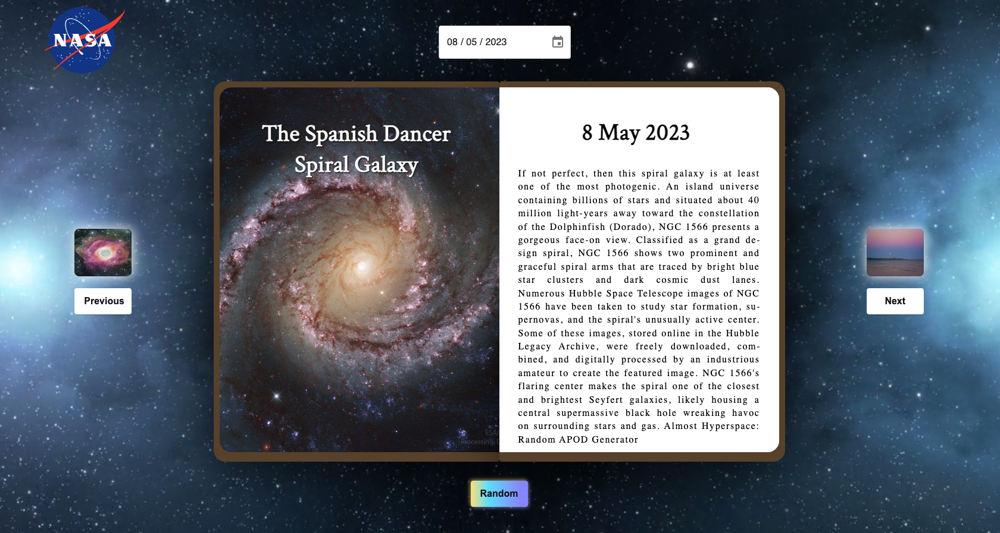

<h1>Project 2: Journal In Space</h1>

<h2>Project Overview</h2>

The second GA Software Engineering immersive course project was in week 7 of the course, with the brief of building a React app that consumes a public API.  We chose an Open API provided by NASA called Astronomy Picture of the Day (APOD), which updates daily with NASA photography, an explanation, along with other data, that we would display in our React app and then deploy to the web.

<h3>Deployment link</h3>

https://journalinspace.com/

<h3>Timeframe & Working Team</h3>

This project was working in a pair with a duration of 2 days (1.5 effective days of coding) for completion.  I worked with fellow General Assembly member Ali Abed-Ali. 

<h3>Technologies Used</h3>

- React.js (using Hooks such as useState and useEffects)
- SASS/SCSS
- HTML5
- Axios (HTTP Client for node.js and the browser)
- DatePicker
- VS Code
- Excalidraw (UX wireframing)
- Insomnia (API testing)
- Netlify
- Git & GitHub
