<h1>Project 2: Journal In Space</h1>

<h2>Project Overview</h2>

The second GA Software Engineering immersive course project was in week 7 of the course, with the brief of building a React app that consumes a public API.  We chose an Open API provided by NASA called Astronomy Picture of the Day (APOD), which updates daily with NASA photography, an explanation, along with other data, that we would display in our React app and then deploy to the web.

<h3>Deployment link</h3>

https://journalinspace.com/

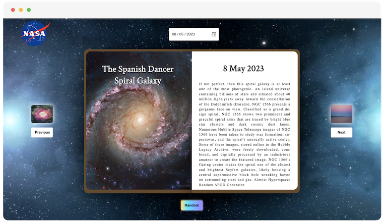

<h3>Timeframe & Working Team</h3>

This project was working in a pair with a duration of 2 days (1.5 effective days of coding) for completion.  I worked with fellow General Assembly member Ali Abed-Ali. 

<h3>Technologies Used</h3>

- React.js (using Hooks such as useState and useEffects)
- SASS/SCSS
- HTML5
- Axios (HTTP Client for node.js and the browser)
- DatePicker
- VS Code
- Excalidraw (UX wireframing)
- Insomnia (API testing)
- Netlify
- Git & GitHub

<h2>The Brief</h2>

- Build a React application that consumes a public API.
- Have several components
- The app can have a router with several ‘pages’
- Include wireframes - that you designed before building the app.
- Be deployed online and accessible to the public (hosted on your public github)

<h2>Planning</h2>

<b>Step 1: Exploring Ideas</b>

First, we brainstormed our interests to see where they overlapped. Quickly, we discovered our shared love for space and instinctively turned to NASA's Open APIs. While we had backup ideas centred around football, cars, and plants, the space theme emerged as our clear favourite.

When consulting all these options, we checked out a number of public APIs that we could consume; to check the structure of the APIs, understand what data we can use, how easy or tricky it would be to use, which helped us formulate some ideas for the concept of the app.

Below is a snapshot of what the NASA API looked like:

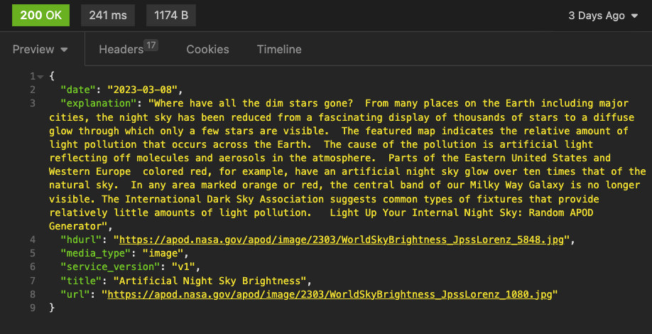

<b>Step 2: Formulating the concept</b>

Once established that the NASA APIs were the ones we wanted to use, we then formulated the concept and vision for the app, given what we knew about the APIs.  The NASA API in question was called the Astronomy Picture of the Day (APOD) API and it was a fairly basic but very interesting API that provided daily assets of high quality images and an associated explanation, along with a few other bits of detail.

From this, we thought of the idea of a ‘space journal’; that provided a daily update of content in what looked like a journal, in a NASA-branded space theme.  The homepage would be today's update, and it would be possible to cycle through previous and next days, as well as have a random date feature.

<b>Step 3: Creating the Wireframe</b>

Creation of wireframe based on the above vision and requirements, at a high-level - which would help define the HTML and SASS of the page, along with what potential functionality would be needed.

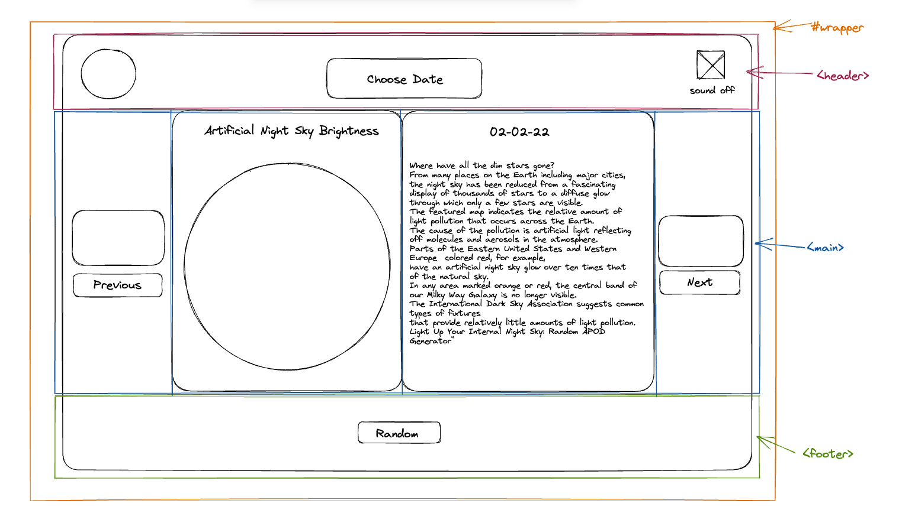

<b>Step 4: Defining the MVP</b>

For our minimum product, we wanted the ability to show at the very least the main content (being the title, date, image and explanation) with the ability to show previous and next items, and the ability to choose a date from a date picker, all being consumed directly from the API.  Each request would require calling the current date’s data, as well as the previous and next day’s data, to be displayed on the React app.

The post-MVP items (if we had time) would be to add a ‘random’ journal entry, and adding a sound option (with the ability to turn an atmospheric soundtrack on and off).

<h2>Build Process</h2>

Initially, we both figured we did not have a massive amount of time to develop the app (1.5 days in total) so we decided to divide and conquer in terms of responsibilities, and then later get together to pair on both areas together.  I initially took on the responsibilities of setting up the grid and general styling, whilst Ali took on the responsibilities of setting up the API and feeding in the data to the React useStates.  Then we would get together and merge the two together, whilst also pairing to go through what we did, assisting each other in adding additional functionality and general debugging.

We set up the initial userStates for the API, requested the associated API keys from NASA, and then used Axios (a promised based HTTP client for node.js) to retrieve data from the NASA API and store them into the associated objects:

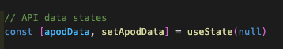
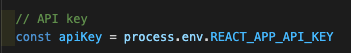
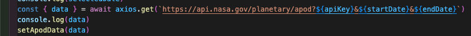

Meanwhile I started on the overall grid, which consisted of a relatively simple HTML5 structure of header, main and footer, contained within a wrapper.  We later broke these down into individual components within React and fed the necessary props through:

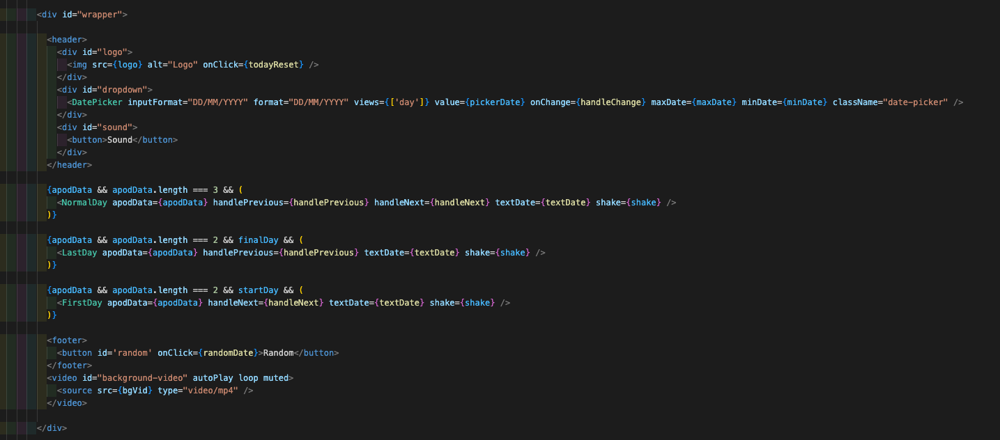

<b>API requests:</b>
The API required us to add three variables to the URL — API key, start date, and end date.  The API key was stored in .env and retrieved as a variable.

The start date, and end date, were determined by either the:
Date picker
Next button
Previous button
Random button
Today’s date (on load)

All of the above would give us a single date, the selectedDate, therefore providing this date was not the first, or last, possible date, we added logic to grab the day before, and the day after, to populate the start date, and end date, respectively — using getStartDate and getEndDate.
formateDateString ensured the date is in the correct format when being passed in to the API request URL.

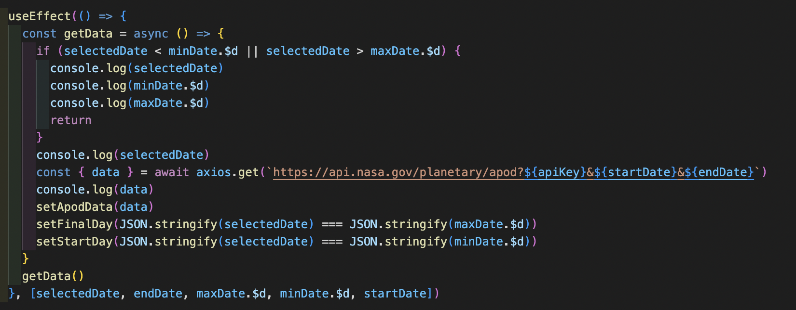

Changes to dates were handled by handleChange for the date picker, handleNext for the next button, handlePrevious for the previous button, randomDate for the random button, and todayReset for the home/logo button. Each function updates the state for both the selectedDate and the pickerDate.

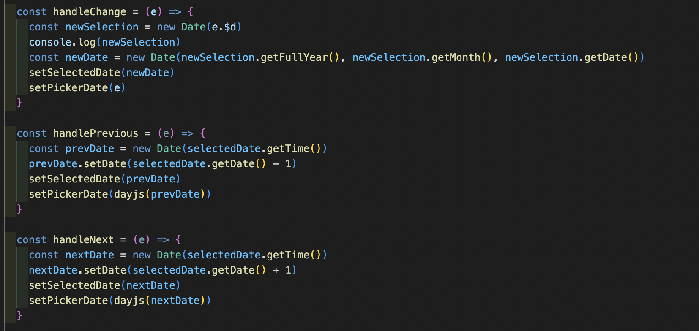

<b>Components:</b>
Given the first and last page would not feature a next or previous button, we created three components to reflect the HTML necessary across scenarios titled firstDay, lastDay and normalDay.
Within each component, logical conditioning was required to determine what actions to take based on the API response. In some instances, a video was returned instead of a picture, and in rare instances neither a picture or video was returned. Due to this, conditional logic was added to ensure the correct action was being taken based on the response (for example, an image required updating the background of a Div, whereas a video required the insertion of an iframe within the Div.

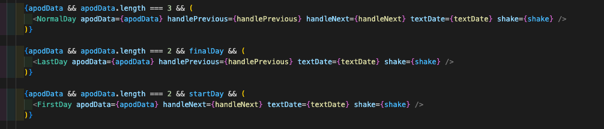

<b>Date Picker:</b>
Using the default HTML date picker ```<input type="date" />``` led to undesirable behaviours when moving across months/years, as the date pre-populated with each change, causing an API request to be sent. To solve this, we used MUI Date Picker (React Date Picker component - MUI X) which allowed us to control and remove this undesirable behaviour. To use this date picker, we had to make use of the dayjs library as well as LocalizationProvider.

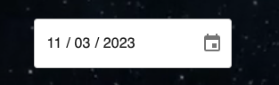

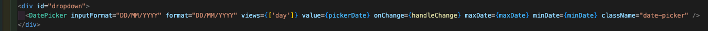

Adding post-MVP features
We also managed to find time to add our favourite post-MVP feature; a random button generator that picked a random date and then updated the UI accordingly.  We also added ‘shake’ functionality, which simulated looking like the book was shaken like a dice, to give that random feel to it.  I also paired this with animated

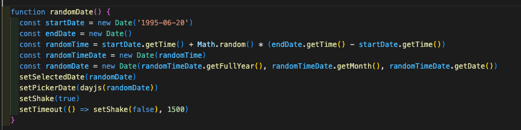

<b>SASS:</b>
I had great fun creating the design and styling of the site using SASS.  Flexbox was used to display the content in a flexible manner and then aligned in the centre of the screen. 

There are a lot of nice touches and details with the design aesthetics. The ‘random’ button has a moving gradient animation in the background, rotates slightly on hover, and then when clicked, produces a ‘shake’ which looks like the book has been shaken.

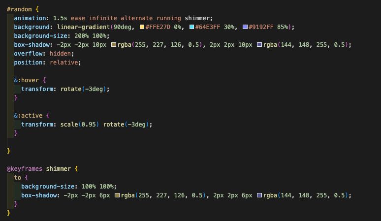

A particular favourite of mine was the video background, which is a free looped video I found on the internet - which was originally 250MB in size, which I then compressed to 2.9MB and it streams/loads perfectly on page load:


<h2>Challenges</h2>

1st challenge:  One of the biggest challenges on the functional side of things was finding ways to compare dates within the logic, as a Date Object includes timestamps. We resolved this by forcing all occurrences of dates to be set to midnight (00:00:00), which enabled us to compare dates with confidence.  JSON.stringify was used to compare two dates, as comparisons can’t be made with two Objects. An alternative to this would have been to use the .getTime() method, which would also have allowed for comparisons.

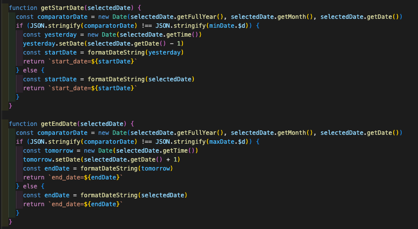

2nd challenge:  One of the most challenging parts on the styling front was that the API returned all sorts of image sizes, horizontal and vertical orientations, as well as differing formats, such as gif and youtube videos.  We had to cater for all content possible, so I had to set the background-image properties that would cater for all scenarios.  We managed to control youtube videos separately in SASS also and render these correctly when viewed.

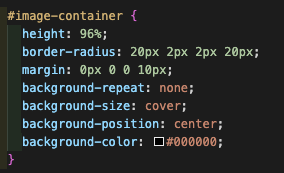

3rd challenge: As we had limited time to complete the project, we found that we had to resort to writing non-optimal code that solves short-term problems, rather than think about the long-term.  For example, we could have refactored the functions to be more reusable and streamlined, and the front-end could have been written in a more responsive way to cater for a wider range of devices and screen sizes.

<h2>Wins</h2>

We got a working solution together pretty quickly, the end solution is very stable, and fits all types of content really well.  We are very happy with the end result as it looks really amazing, and we got great feedback when it was presented to the wider group.

We got all of the MVP features and post-MVP features implemented, with the exception of adding an audio playback.  However, we were very selective to ensure quality over quantity.

This was definitely a passion project of ours and we want to continue to improve it.  I really enjoyed working with Ali; we definitely had a good balance of skills and we collaborated together very closely.  He was a pleasure to work with from start to finish.

<h2>Key Learnings</h2>

We both feel a lot more comfortable with React.js useStates and useEffects, as well as consuming API data, and testing them using Insomnia.  We also learnt some new things about using API keys and deploying the site to Netlify.

I also got a chance to expand experience with using SASS, including animations, transform, and keyframes, as well as video background.

<h2>Bugs</h2>

Nothing to note here.

<h2>Future Improvements</h2>

1) Add mobile responsive - it currently doesn’t work on mobile or responsive layouts, so this would be the first thing I would like to improve.
- UPDATE: This has now been updated and live!
2) Have the ability to maximise the content in a larger screen - i.e. to show the high quality images more effectively if the user wants to.
3) Add audio - we ran out of time to add this in, but it would be nice to have an ambient soundtrack like you are speeding through space :)
4) Add some cool transitions / animations to emulate the turning of a page when clicking next or previous buttons.  A little gimmicky and could look tacky, but worth exploring.


